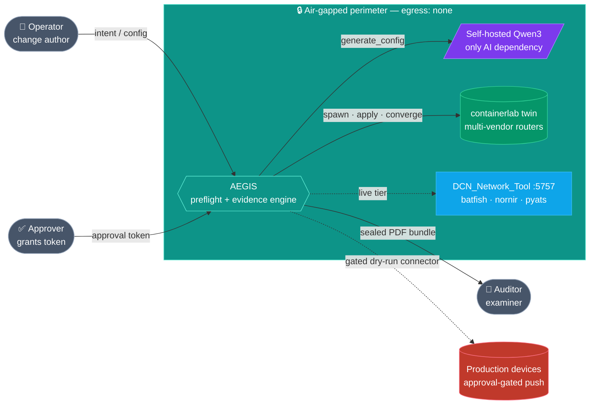

<p align="center"></p>

# AEGIS

> **Air-gapped Evidence-Grade Inspection System** — preflight network changes against a
> *real* digital twin, entirely inside your perimeter. No cloud. No data egress. Ever.

[](LICENSE)
[](https://github.com/gesh75/aegis/actions/workflows/test.yml)
[](#)
[](#)
[](docs/PHASES.md)

The air-gapped, self-hosted answer to Forward Predict / NetPilot: those are
cloud-by-architecture, so regulated networks that legally cannot send topology/config
off-prem are locked out of them. AEGIS runs the same **change → twin → validate → evidence**
loop on a self-hosted LLM + containerlab, and emits a tamper-evident, framework-mapped,
examiner-ready evidence bundle.


## Demo

[](docs/overview_video.mp4)

▶ **[Watch the 64-second overview](docs/overview_video.mp4)** (silent, captioned) ·
**[narrated 2-minute cut](docs/overview_video_narrated.mp4)**

<!-- INLINE PLAYER (optional, after first push): create a GitHub Release, drag
     docs/overview_video.mp4 into it, copy the https://github.com/gesh75/aegis/assets/…
     URL GitHub generates, and paste it here as a bare line — GitHub renders a video player. -->

## How it works

```
intent | paste-config ─▶ guard ─▶ generate (LLM) ─▶ batfish ─▶ spawn twin ─▶ apply+converge
                     ─▶ diff ─▶ compliance ─▶ risk tier ─▶ rollback ─▶ verdict ─▶ evidence bundle
```

Only `generate` touches an LLM — and the **config-import** path skips even that. Every step
after the proposal is **deterministic verification** (the "guarded agentic" pattern). That is
what makes the evidence auditable: the LLM proposes, the pipeline verifies, a human
authorizes, and the sealed bundle proves nothing left the perimeter.

## Why it's different

| | Forward Predict | NetPilot | **AEGIS** |
|---|---|---|---|
| Twin | math model | cloud emulation | **real on-host emulation (containerlab)** |
| Hosting | SaaS | cloud | **on-prem / air-gapped** |
| LLM | cloud | cloud | **self-hosted (zero egress)** |
| Output | report | — | **sealed, PCI/SOC2/NIST-mapped evidence + PDF** |

## 🏛️ Architecture

Everything runs inside an **air-gapped perimeter**: the operator submits a change, a
self-hosted Qwen3 LLM proposes config, a throwaway containerlab twin verifies it, and an
auditor consumes the sealed PDF — no actor or line ever reaches outside the wall.



📐 **Full architecture** — system context, container/component map, primary sequence, data
flow, the `Backend` Protocol class map, and the verdict/promotion-gate decision tree — lives in
**[docs/ARCHITECTURE.md](docs/ARCHITECTURE.md)**.

## Run the demo (community / sim tier — fully offline)

```bash
docker compose up                 # then open http://localhost:8088/preflight
# or, without Docker:
pip install -r requirements.txt
python -m aegis.serve             # from the directory ABOVE aegis/
```

Type a change (or paste a config), Run PreFlight, watch the verdict + sealed evidence
bundle, and download the examiner-ready PDF. Live mode (real Qwen3 + containerlab twin)
ships in the integrated air-gapped product — see [`docs/GO_LIVE.md`](docs/GO_LIVE.md).

### Air-gapped install (zero egress)

```bash
docker compose build && docker save aegis:local -o aegis-local.tar   # online, once
# carry aegis-local.tar across the air gap on signed media, then:
docker load -i aegis-local.tar
docker compose -f docker-compose.yml -f docker-compose.airgap.yml up  # network_mode: none
```

## Test — 6 suites, 0 violations

```bash
pip install -r requirements.txt
python -m aegis.tests.stress_test 25000      # pipeline invariants (8 invariants, adversarial)
python -m aegis.tests.contract_test          # HttpBackend parsers vs real :5757 shapes
python -m aegis.tests.pdf_test               # evidence PDF validity
python -m aegis.tests.promote_test           # Phase 2 approval-gate safety
```

| Suite | Scale | Result |
|---|---|---|
| pipeline invariants | 25,000 runs | ✅ PASS |
| HttpBackend contract | real API shapes | ✅ PASS |
| evidence PDF | 1,500 bundles | ✅ PASS |
| promotion gate | 6,000 bundles | ✅ PASS |
| Flask test-client | 10 tests | ✅ PASS |
| twin safety + mgmt isolation | 8,000 ops | ✅ PASS |

## Layout

```
core/orchestrator/   deterministic pipeline · guards · rollback
core/backends/       pluggable: simulator (CI) | http (live :5757)
core/promote/        Phase 2 approval gate + connectors (dry-run default)
evidence/            bundler · sha256 seal · compliance crosswalk · PDF · JSON schema
ui/                  self-contained PreFlight dashboard
serve.py             standalone community server (sim tier)
docs/                PHASES.md · GO_LIVE.md · architecture.svg
```

## Project history & roadmap

Every phase — research → positioning → scaffold → live adapters → twin endpoints → UI →
evidence PDF → config-import → mgmt isolation → packaging → Phase 2 promotion gate — is
logged in [`docs/PHASES.md`](docs/PHASES.md). Changelog: [`CHANGELOG.md`](CHANGELOG.md).

## License

Apache-2.0 (see [LICENSE](LICENSE)). The community core is open; live production-push
connectors, RBAC, and hosted multi-tenant compute are the commercial tier.
