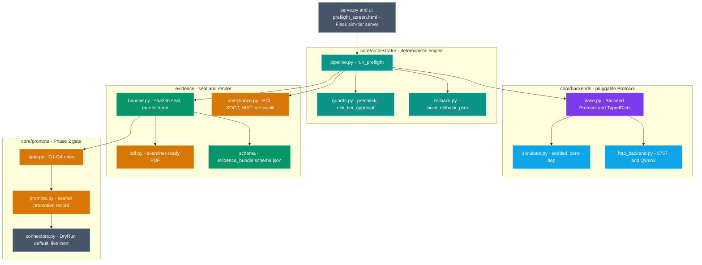
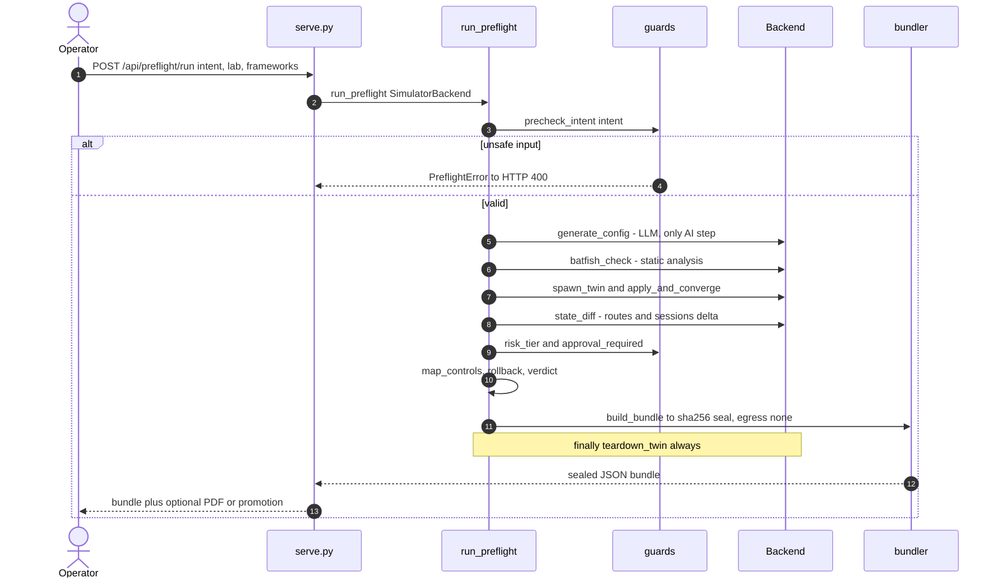
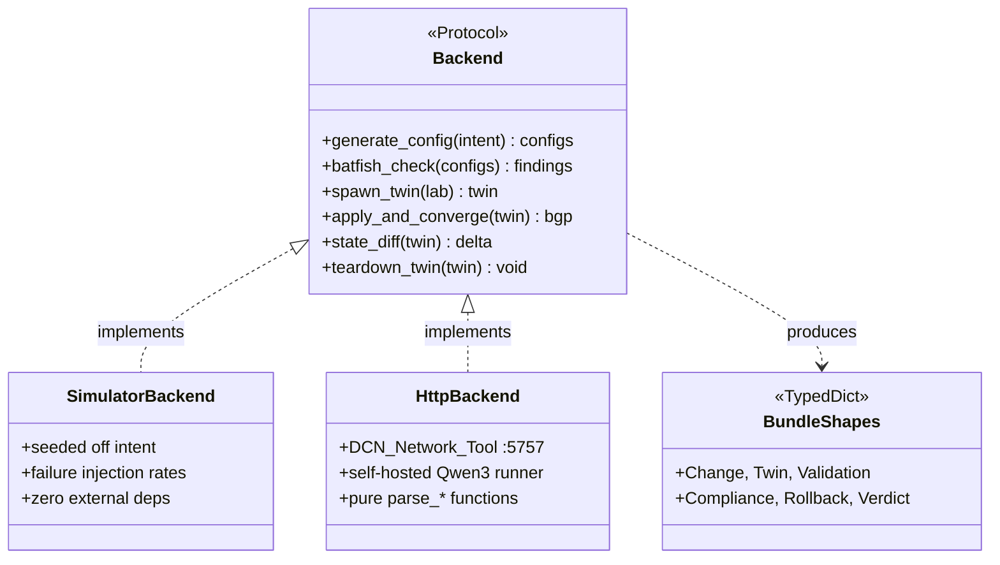
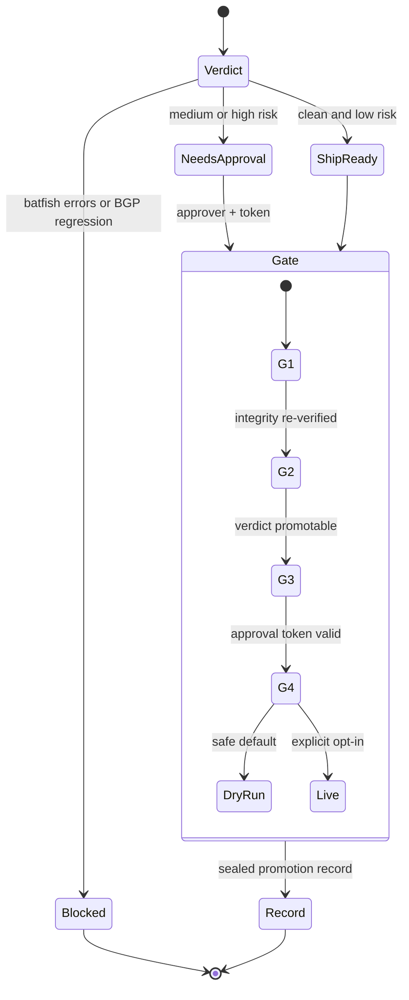

# 🏛️ AEGIS — Architecture

**AEGIS** (Air-gapped Evidence-Grade Inspection System) is a self-hosted Python tool that
preflights network changes against a *real* containerlab digital twin entirely inside the
perimeter, then emits a tamper-evident, framework-mapped, examiner-ready evidence bundle.

It runs a **guarded-agentic** loop: a self-hosted LLM proposes config from a natural-language
intent (or the operator pastes config and skips the LLM), and every step afterward — static
analysis, twin spawn/converge, diff, compliance mapping, risk tiering, rollback, verdict — is
**deterministic verification**. A pluggable `Backend` Protocol lets the identical pipeline run
in an in-process simulator (CI / community tier) or against an in-perimeter HTTP stack (live
tier); a Phase 2 promotion gate can push an approved, sealed bundle to production through a
dry-run-by-default connector.

> **Design invariant:** only `generate_config` touches an LLM. Everything after it verifies.
> No line ever crosses the air-gap perimeter outward — only a sealed evidence badge leaves.

---

## Table of Contents

1. [System Context](#1-system-context)
2. [Container & Component Map](#2-container--component-map)
3. [Primary Flow (sequence)](#3-primary-flow-sequence)
4. [Data Flow Pipeline](#4-data-flow-pipeline)
5. [Backend Protocol (class map)](#5-backend-protocol-class-map)
6. [Verdict & Promotion-Gate Decision Tree](#6-verdict--promotion-gate-decision-tree)
7. [Tech Stack](#7-tech-stack)

---

## 1. System Context

Everything sits inside an **air-gapped perimeter**. The operator submits a change through the
PreFlight UI; a self-hosted Qwen3 LLM proposes config; a throwaway containerlab twin verifies
it; an auditor consumes the sealed PDF. No actor or line reaches outside the wall.

---

## 2. Container & Component Map

The codebase splits into four colored layers: the **orchestrator** drives the loop, the
**backends** abstract where work runs, **evidence** seals and renders the output, and
**promote** gates a verified bundle toward production. `serve.py` + the HTML UI expose the
community sim tier.

---

## 3. Primary Flow (sequence)

One end-to-end PreFlight run: the UI POSTs an intent, the guard layer prechecks it before any
twin resources are spent, the backend proposes and verifies the change against a throwaway
twin, and the bundler seals the result. The twin is **always** torn down in a `finally` block.

---

## 4. Data Flow Pipeline

The change flows left-to-right through eleven deterministic stages. Only the **generate** step
(violet) is AI; the **batfish** gate (crimson) can block, and the final **seal** (amber) pins
egress to none. Everything between is teal verification.

---

## 5. Backend Protocol (class map)

The `Backend` Protocol is the **guarded-agentic boundary**: it declares six operations, but
only `generate_config` touches an LLM — the rest are verification. Two implementations satisfy
it identically, so the same pipeline runs in CI and against the live :5757 stack.

---

## 6. Verdict & Promotion-Gate Decision Tree

The verdict resolves to one of three outcomes from batfish errors, twin convergence, BGP
regression, and approval state. A `ship_ready` bundle may pass through the Phase 2 gate, whose
four rules (G1–G4) decide whether the change reaches a connector — dry-run by default.

---

## 7. Tech Stack

| Layer | Technologies |
|---|---|
| **Language** | Python 3.10+ (pure stdlib core, backend-agnostic via `typing.Protocol`) |
| **Orchestration** | Deterministic pipeline · dataclasses · frozen dataclasses (promote) |
| **AI (only step)** | Self-hosted Qwen3, OpenAI-compatible `/v1/chat/completions` |
| **Twin** | containerlab + Docker (srlinux / ceos / frr / junos / ios / panos) |
| **Static analysis** | Batfish-style check via DCN_Network_Tool `:5757` |
| **Evidence** | `hashlib` sha256 seal · canonical JSON · JSON Schema draft-07 · `jsonschema` 3.2.0 |
| **PDF** | `reportlab` (A4 platypus tables) — air-gap safe |
| **Server / UI** | Flask 3.x (loopback-bound, strict CSP, 2 MB cap) · single inline-asset HTML |
| **Networking** | `urllib` only — no cloud, no external DNS |
| **CI / tests** | 6 invariant + contract suites (`stress`, `promote`, `twin`, `pdf`, `contract`, `api`) |

---

AEGIS · the LLM proposes inside the wall · the twin verifies · only a sealed badge leaves

