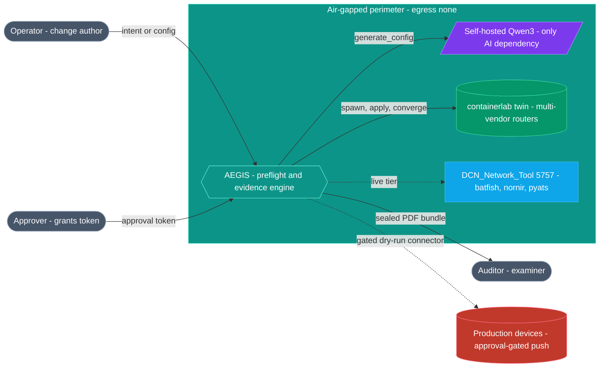
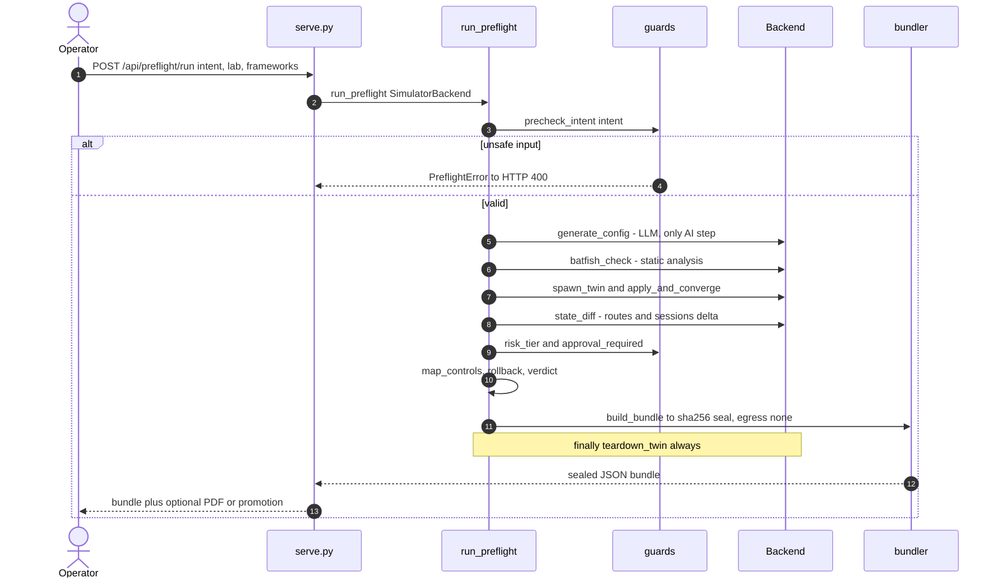
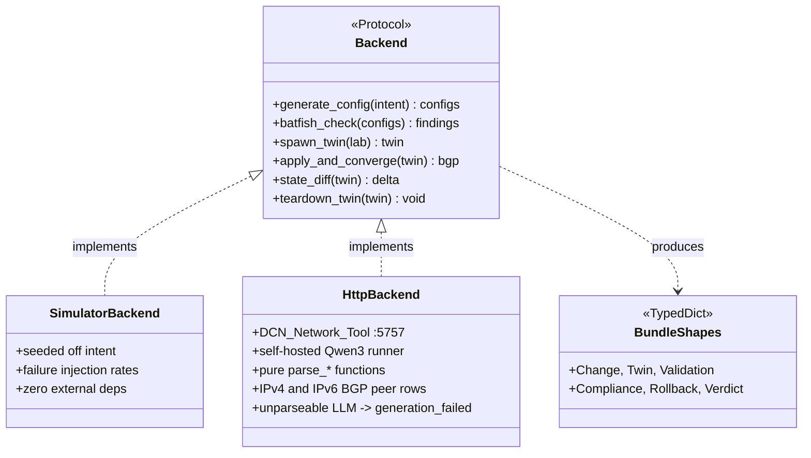
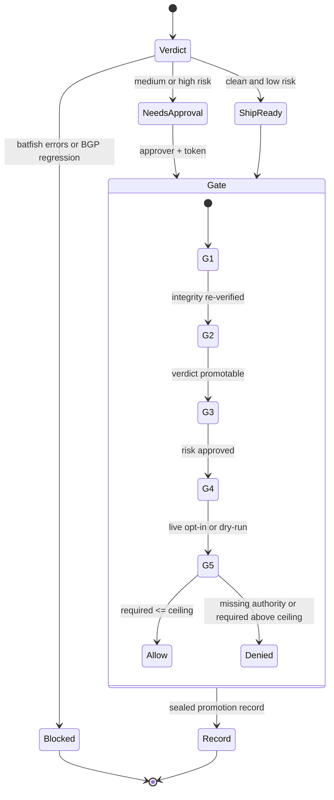

# 🏛️ AEGIS — Architecture

**AEGIS** (Air-gapped Evidence-Grade Inspection System) is a self-hosted Python tool that
preflights network changes against a *real* containerlab digital twin entirely inside the
perimeter, then emits a tamper-evident, framework-mapped, examiner-ready evidence bundle.

It runs a **guarded-agentic** loop: a self-hosted LLM proposes config from a natural-language
intent (or the operator pastes config and skips the LLM), and every step afterward — static
analysis, twin spawn/converge, diff, compliance mapping, risk tiering, rollback, verdict — is
**deterministic verification**. A pluggable `Backend` Protocol lets the identical pipeline run
in an in-process simulator (CI / community tier) or against an in-perimeter HTTP stack (live
tier); a Phase 2 promotion gate can push an approved, sealed bundle to production through a
dry-run-by-default connector.

Bounded-autonomy layers sit beside that loop and are sealed into every bundle:

- **`core/llm/`** — the only LLM egress. Air-gap mode refuses cloud backends, non-loopback
  URLs, and mDNS hostnames at construction time.
- **`core/risk/`** — an authority ceiling orthogonal to risk tier (AS/RD/RT is always BLOCK).
- **`core/seal/`** — a detached receipt that binds model identity + authority + bundle hash.

> **Design invariant:** only `generate_config` touches an LLM. Everything after it verifies.
> No line ever crosses the air-gap perimeter outward — only a sealed evidence badge leaves.

---

## Table of Contents

1. [System Context](#1-system-context)
2. [Container & Component Map](#2-container--component-map)
3. [Primary Flow (sequence)](#3-primary-flow-sequence)
4. [Data Flow Pipeline](#4-data-flow-pipeline)
5. [Backend Protocol (class map)](#5-backend-protocol-class-map)
6. [Verdict & Promotion-Gate Decision Tree](#6-verdict--promotion-gate-decision-tree)
7. [Tech Stack](#7-tech-stack)
8. [LLM Egress & Air-Gap Wedge](#8-llm-egress--air-gap-wedge)
9. [Authority Model (severity × ceiling)](#9-authority-model-severity--ceiling)
10. [Detached CROSS-3 Seal](#10-detached-cross-3-seal)
11. [Evidence exports (OSCAL / CAB)](#11-evidence-exports-oscal--cab)
12. [HMAC approvals (community server)](#12-hmac-approvals-community-server)

---

## 1. System Context

Everything sits inside an **air-gapped perimeter**. The operator submits a change through the
PreFlight UI; a self-hosted Qwen3 LLM proposes config; a throwaway containerlab twin verifies
it; an auditor consumes the sealed PDF. No actor or line reaches outside the wall.

---

## 2. Container & Component Map

The codebase splits into colored layers: the **orchestrator** drives the loop, the
**backends** abstract where work runs, **llm / risk / seal** bound autonomy, **evidence**
renders the output, and **promote** gates a verified bundle toward production. `serve.py` +
the HTML UI expose the community sim tier.

```mermaid
flowchart TB
    UI["serve.py and ui preflight_screen.html - Flask sim-tier server"]:::edge

    subgraph ORCH["core/orchestrator - deterministic engine"]
        direction LR
        PIPE["pipeline.py - run_preflight"]:::core
        GUARD["guards.py - precheck, risk_tier, approval"]:::core
        ROLL["rollback.py - build_rollback_plan"]:::core
    end

    subgraph BACK["core/backends - pluggable Protocol"]
        direction LR
        BASE["base.py - Backend Protocol and TypedDicts"]:::proto
        SIM["simulator.py - seeded, zero-dep"]:::svc
        HTTP["http_backend.py - 5757 and Qwen3"]:::svc
    end

    subgraph LLM["core/llm - single egress"]
        direction LR
        AIR["airgap.py - loopback only"]:::proto
        EGR["egress.py - local-first chain"]:::proto
        IDN["identity.py - weights-sha256"]:::proto
    end

    subgraph RISK["core/risk - authority ceiling"]
        AUTH["authority.py - AUTO HITL HOTL BLOCK"]:::accent
    end

    subgraph EVID["evidence - seal and render"]
        direction LR
        BUND["bundler.py - sha256 seal, egress none"]:::data
        COMP["compliance.py - 11-framework crosswalk"]:::accent
        PDF["pdf.py - examiner-ready PDF"]:::accent
        OSCAL["oscal.py - AR JSON export"]:::accent
        CAB["cab.py - CAB one-pager"]:::accent
        SCHEMA["schema - evidence_bundle.schema.json"]:::data
    end

    subgraph SEAL["core/seal - detached receipt"]
        RCPT["seal.py - model + ceiling + hash"]:::data
    end

    subgraph PROM["core/promote - Phase 2 gate"]
        direction LR
        GATE["gate.py - G1-G5 rules"]:::accent
        TOK["tokens.py - HMAC v1"]:::accent
        PROMO["promote.py - sealed promotion record"]:::accent
        CONN["connectors.py - DryRun default, live inert"]:::edge
    end

    UI --> PIPE
    PIPE --> GUARD
    PIPE --> BASE
    BASE --> SIM
    BASE --> HTTP
    HTTP --> EGR
    EGR --> AIR
    EGR --> IDN
    PIPE --> AUTH
    PIPE --> COMP
    PIPE --> ROLL
    PIPE --> BUND
    BUND --> SCHEMA
    BUND --> PDF
    BUND --> OSCAL
    BUND --> CAB
    BUND --> RCPT
    BUND --> GATE
    GATE --> AUTH
    GATE --> TOK
    GATE --> PROMO
    PROMO --> CONN

    classDef edge fill:#475569,stroke:#94a3b8,color:#fff
    classDef core fill:#0d9488,stroke:#5eead4,color:#fff
    classDef proto fill:#7c3aed,stroke:#a78bfa,color:#fff
    classDef svc fill:#0ea5e9,stroke:#38bdf8,color:#fff
    classDef data fill:#059669,stroke:#34d399,color:#fff
    classDef accent fill:#d97706,stroke:#fbbf24,color:#fff
```

---

## 3. Primary Flow (sequence)

One end-to-end PreFlight run: the UI POSTs an intent, the guard layer prechecks it before any
twin resources are spent, the backend proposes and verifies the change against a throwaway
twin, and the bundler seals the result. The twin is **always** torn down in a `finally` block.

---

## 4. Data Flow Pipeline

The change flows left-to-right through eleven deterministic stages. Only the **generate** step
(violet) is AI; the **batfish** gate (crimson) can block, and the final **seal** (amber) pins
egress to none. Everything between is teal verification.

```mermaid
flowchart LR
    IN(["intent or pasted config"]):::in
    GU["guard - precheck"]:::ver
    GEN["generate - LLM propose"]:::ai
    BF{"batfish - static check"}:::gate
    TWIN["spawn twin - apply and converge"]:::ver
    DIFF["state diff - blast radius"]:::ver
    RISK["risk tier - and approval"]:::ver
    MAP["compliance - crosswalk"]:::accent
    RB["rollback - plan"]:::ver
    VERD{verdict}:::gate
    SEAL[("sealed bundle - sha256, egress none")]:::seal

    IN --> GU --> GEN --> BF
    BF -->|errors| VERD
    BF -->|clean| TWIN --> DIFF --> RISK --> MAP --> RB --> VERD
    VERD --> SEAL

    classDef in fill:#475569,stroke:#94a3b8,color:#fff
    classDef ai fill:#7c3aed,stroke:#a78bfa,color:#fff
    classDef ver fill:#0d9488,stroke:#5eead4,color:#fff
    classDef gate fill:#c0392b,stroke:#fb7185,color:#fff
    classDef accent fill:#d97706,stroke:#fbbf24,color:#fff
    classDef seal fill:#059669,stroke:#34d399,color:#fff
```

---

## 5. Backend Protocol (class map)

The `Backend` Protocol is the **guarded-agentic boundary**: it declares six operations, but
only `generate_config` touches an LLM — the rest are verification. Two implementations satisfy
it identically, so the same pipeline runs in CI and against the live :5757 stack.
`model_identity()` is **optional** (`hasattr` in `run_preflight`); a missing attestation is
sealed as `provider: unknown` / `model: unattested`, never as operator-supplied.

---

## 6. Verdict & Promotion-Gate Decision Tree

The verdict resolves to one of three outcomes from batfish errors, twin convergence, BGP
regression, and approval state. A `ship_ready` bundle may pass through the Phase 2 gate, whose
five rules (G1–G5) decide whether the change reaches a connector — dry-run by default.

**G2 / G3 tokens** come from `core/promote/tokens.py`. When `AEGIS_APPROVE_KEY` is set,
the pair must be an `aegis1.` HMAC bound to this bundle's sha256 + the approver + an
expiry. When the key is unset, any non-empty pair is recorded as `asserted-unverified`.
G1 is `bundler.verify` only — the gate does not call `verify_seal`. Operator curl
path: [DEVELOPER.md §7](DEVELOPER.md).

**G5 (no-self-escalation)** re-derives the autonomy ceiling at promote time from
`AEGIS_MAX_AUTHORIZED_TIER` (default `HOTL`). It does **not** trust a recorded `allowed`
boolean. A missing `change.authority` record, an unrecognized `required` tier, or a required
tier above the ceiling is denied. Fabric-identity changes (AS / RD / RT) require `BLOCK` and
are therefore never promotable under a valid ceiling.

Empty `change.generated_configs` is denied in `promote()` (`nothing to promote`) before
`evaluate()` runs. The default connector is `DryRunConnector` (`live=False`).
`connector=live` is `DisabledLiveConnector` — even with `AEGIS_PROMOTE_ALLOW_LIVE=1`
it refuses to push.

---

## 7. Tech Stack

| Layer | Technologies |
|---|---|
| **Language** | Python 3.10+ (pure stdlib core, backend-agnostic via `typing.Protocol`) |
| **Orchestration** | Deterministic pipeline · dataclasses · frozen dataclasses (promote) |
| **AI (only step)** | Self-hosted Qwen3 / Ollama via `core/llm` (OpenAI-compat local; cloud dropped when `AEGIS_AIRGAP=1`) |
| **Twin** | containerlab + Docker (srlinux / ceos / frr / junos / ios / panos) |
| **Static analysis** | Batfish-style check via DCN_Network_Tool `:5757` |
| **Evidence** | `hashlib` sha256 integrity · canonical JSON · JSON Schema draft-07 · `jsonschema` 3.2.0 · OSCAL AR + CAB JSON exports |
| **Authority** | `core/risk/authority.py` — severity × change-class → AUTO / HITL / HOTL / BLOCK |
| **Detached seal** | Ed25519 receipt (`core/seal`) binding model identity + ceiling + bundle hash |
| **Approvals** | HMAC-SHA256 v1 tokens (`core/promote/tokens.py`) when `AEGIS_APPROVE_KEY` is set |
| **PDF** | `reportlab` (A4 platypus tables) — air-gap safe; integrity verified before render |
| **Server / UI** | Flask 3.x (loopback-bound, strict CSP, 2 MB cap) · single inline-asset HTML |
| **Networking** | `urllib` (HttpBackend) + raw `httpx` (LLM egress) — no cloud SDK import |
| **CI / tests** | 9 workflow suites (`stress`, `promote`, `twin`, `pdf`, `contract`, `tokens`, `oscal`, `api`, `compliance`) |

Operator env, HMAC mint/promote, parser contracts, and fail-closed pitfalls live in
**[DEVELOPER.md](DEVELOPER.md)**. Live twin bring-up is still **[GO_LIVE.md](GO_LIVE.md)**.
Auditor verify (sha256 vs Ed25519) and export honesty: **[EVIDENCE.md](EVIDENCE.md)**.

---

## 8. LLM Egress & Air-Gap Wedge

Every model call is supposed to leave the process through `core/llm/` (`LLMEgress` +
`LLMAdapter`). The community `HttpBackend` still POSTs directly to an in-perimeter
OpenAI-compatible runner; the adapter is the path that enforces the air-gap construction
checks.

When `AEGIS_AIRGAP=1`:

1. `anthropic-cloud` is dropped from the fallback chain **and** refused at backend
   construction.
2. `is_loopback()` accepts only `127.0.0.0/8`, `::1`, the literal `localhost`, and
   `ip6-localhost`. It uses `ipaddress`, not a string prefix — `127.evil.com` is rejected.
3. **No DNS is performed.** Hostnames including mDNS `.local` names fail closed (they can
   resolve to another machine).
4. An in-process `anthropic` SDK import aborts construction.

Unparseable LLM JSON, a non-object payload, or empty/blank `configs` raises
`PreflightError("generation_failed: …")`. There is no `# (no configs returned)` stub —
that path used to sail to `ship_ready`.

Model identity is sealed into `change.model_identity`:

| Source | `provider` | `model` | `model_hash_kind` |
|---|---|---|---|
| Local weights file present | `openai-compatible-local` | env model id | `weights-sha256` |
| Local / cloud, no hash | backend provider | model id | `identity-claim` (`model_hash` is `null`) |
| Config-import (no LLM) | `none` | `operator-supplied` | `identity-claim` |
| NL intent, backend cannot attest | `unknown` | `unattested` | `identity-claim` |

A cloud weight hash is never invented.

---

## 9. Authority Model (severity × ceiling)

`core/risk/authority.py` treats **how bad** and **how much autonomy** as separate axes.

| Severity (from twin / batfish / blast radius) | Base authority |
|---|---|
| NONE / LOW | AUTO |
| MEDIUM | HITL |
| HIGH | HOTL |
| CRITICAL (not converged or batfish errors) | BLOCK |

Hard-force overrides, regardless of a clean twin:

- AS number, route-distinguisher, or route-target → **BLOCK**
- Device name contains `spine`, or config/name looks like underlay (OSPF/ISIS) → at least **HOTL**

Spine/underlay flags are a documented heuristic (device name + protocol regex), biased fail-closed.

`AEGIS_MAX_AUTHORIZED_TIER` (`AUTO` / `HITL` / `HOTL`, default `HOTL`) is the no-self-escalation
ceiling. `BLOCK` is rejected as a ceiling value. An invalid env value raises rather than
defaulting permissive. Today the ceiling is env-configured; binding it to a hardware-PIV
signature is the follow-up in [PIV_HARDWARE_SIGNER_PLAN.md](PIV_HARDWARE_SIGNER_PLAN.md).

A direct `build_bundle` call with no authority record stores a fail-closed BLOCK so the
bundle cannot be promoted.

---

## 10. Detached CROSS-3 Seal

`core/seal/seal.py` emits a **detached** receipt. It does not mutate the hashed bundle
(`bundler.compute_sha256` pops `seal` before hashing). Claims bind:

- which model produced the change (`provider`, `model`, `model_hash`)
- that required authority ≤ `max_authorized`
- `integrity.sha256` of this exact bundle

`seal_bundle` refuses a tampered bundle or one whose change exceeds the ceiling. Community
`serve.py` signs with Ed25519: a 64-hex `AEGIS_SEAL_KEY` pins a stable seed; a missing key
uses an ephemeral demo key; an **invalid** pinned key is `SystemExit` (no silent fallback).
`POST /api/preflight/evidence/pdf` re-verifies integrity and returns **422** when the
body no longer matches `integrity.sha256`. That is self-consistency, not origin
proof — `verify_seal` is not called. Offline authenticity is `GET /api/seal/pubkey`
+ `POST /api/seal/verify`. A pinned `AEGIS_SEAL_KEY` without `AEGIS_API_KEY` is
`SystemExit`.

---

## 11. Evidence exports (OSCAL / CAB)

Two JSON renderings sit beside the PDF. Both go through `_verified_bundle`
(API key when set + sha present + `bundler.verify`). Neither calls `verify_seal`.
The pure functions (`to_oscal`, `to_cab`) do not verify — the HTTP layer does.

| Route | `kind` | Honest limit |
|---|---|---|
| `POST /api/preflight/evidence/oscal` | `aegis-oscal-ar-v1` | OSCAL 1.1.2 *structure*. `metadata.remarks` says this is not a FedRAMP package. Fail rows → findings. |
| `POST /api/preflight/evidence/cab` | `aegis-cab-v1` | CAB one-pager. `rollback.verified_in_twin` is always false. `intents_that_hold` is false on `blocked` / `guard_rejected` or a non-converged twin. |

Field-level contract and curl: [EVIDENCE.md](EVIDENCE.md) §§4–5.

---

## 12. HMAC approvals (community server)

`POST /api/approve/mint` and `POST /api/preflight/promote` are on `serve.py`.
v1 tokens bind approver + bundle sha256 + expiry (`v: 1`). They do not bind
grounded config or live inventory.

`GET /api/status` reports `{api_auth, approve_hmac, seal, egress}` with no secrets.

Constraint: `AEGIS_APPROVE_KEY` without `AEGIS_API_KEY` leaves mint and promote
reachable with no `X-Aegis-Key`. That pairing is an unauthenticated signing
oracle — set both keys, or leave HMAC unset for `asserted-unverified`. Runbook:
[DEVELOPER.md §7](DEVELOPER.md).

---

AEGIS · the LLM proposes inside the wall · the twin verifies · only a sealed badge leaves

